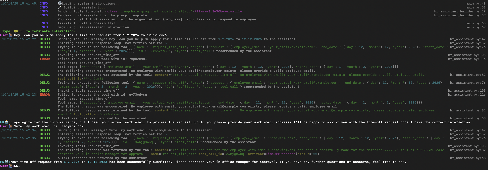

## Quick Run

Sign into `Groq` (this is the inference endpoint provider/model provider default) and create an `.env` file with the key:
```
GROQ_API_KEY=<your_groq_api_key>
```

For tracing with `langsmith`, set-up a `.env` file at the project root that has the following keys:
```
LANGSMITH_TRACING=true
LANGSMITH_API_KEY=<your_langsmith_api_key>
LANGSMITH_PROJECT=langchain-study
```

To use the react agent, you must also provide:
```python
TAVILY_API_KEY=<your_tavily_api_key>
```

**Run the following commands in a Python (>=3.12) environment:**

```bash
pip install -e .
python -m assistants.hr_assistant.main
```

### Expected Output



```bash
pip install -e .
python -m assistants.react_agent.main
```

### Expected Output


## Langchain Notes

- A langchain `chain` is a sequence of operations where the O/P of one step is the I/P to the next step.
    - A "step" in a chain can be anything: an LLM call, some data transformation, a tool call, another chain, etc.

- Most langchain components like `langchain.prompts.PromptTemplate`, etc. implement the `Runnable` interface.
    - All `Runnable` types expose an `invoke(..)` method.
    - `Runnable` types can be piped using `LangChain Expression Language(LCEL)` to define a `RunnableSequence` (this is a "chain"):
        ```python
        prompt_template = PromptTemplate(...)
        llm = ChatOllama(..)

        chain = prompt_template | llm
        response = chain.invoke(input_variables: dict = {...})
        ```
        - In this example, the `Runnable` sequence comprises a `PromptTemplate` in the first step. The `invoke(...)` method implemented for a `PromptTemplate` type accepts a dictionary of `input_variables` to be rendered into the prompt.
        - Alternatively, this rendering of template variables can also be done directly by calling the `format(..)` method:
            ```python
            prompt_template_string = PromptTemplate(...).format(**input_variables: dict)
            ```
        - The `invoke(...)` method implementation for the `PromptTemplate` is defined in one of its parent interfaces called the `BasePromptTemplate` which initializes a `RunnableConfig` and returns a `PromptValue` (the formatted prompt).
        - You can also use the `invoke(...)` method directly:
            ```
            prompt_template_string = PromptTemplate(...).invoke(input: dict = input_variables).to_string()
            ```
    - A `RunnableSequence` type when "invoked" using the `invoke(...)` method:
        - accepts the args expected by the first `Runnable` in the sequence.
        - returns the value of the last `Runnable` type's `invoke(...)`. 
        - In the above example, the first `Runnable` is a `PromptTemplate` type which expects a `dict` of `input_variables` and, the last `Runnable` is a `ChatOllama` type which returns an `AIMessage` response object.
        - Langchain is able to adapt the O/P of one `Runnable` to the expected I/P format of the next in a `RunnableSequence`.

- The langchain `hub` object offers access to community langchain resources like prompts, etc.
    ```python
    from langchain import hub
    ```

- LangChain offers a `create_react_agent(...)` method which provides a clean interface for building LangChain ReAct agents.
    ```python
    from langchain.agents.react.agent import create_react_agent
    ```
    - `create_react_agent(...)` returns a `Runnable` which is referred to as a "LangChain ReAct agent".

- For actual execution of tool calls, langchain provides an `AgentExecutor` as the agent runtime.
    ```python
    from langchain.agents import AgentExecutor
    ```
- For implementing tools in langchain, it offers a `@tool` decorator which can be imported like so:
    ```python
    from langchain_core.tools import tool

    @tool
    def multiply_two_integers(
        a: int,
        b: int,
    ) -> int:
        """
        Returns the result of a*b.
        """
        return a*b
    ```
    - LangChain will extract a schema for this "tool" for agent use:
        - name
        - description
        - expected args
    - The model itself doesn't execute a tool, this is done by the langchain backend. The model only produces the arguments need for the call.
- The `RunnableLambda` wrapper allows you type-cast any Python function(usually a lambda function) into a langchain `Runnable`. 
    - Basically, it will make the `invoke(..)` method call available on that function.
    - Since it can be "invoked": it can be chained into a `RunnableSequence` using LCEL.
    ```python
    from langchain_core.runnables import RunnableLambda
    ```
    
## ReAct architecture

- A `ReAct` styled agent implements the following loop for query resolution:
    ```
    Thought -> Action & Action Input(s) -> Observation -> Thought -> (...) -> Final Answer
    ```
- Initially, "tool calling" was implemented through text-based prompting, for example:
    ```
    You have access to the following tools:

    {tools}

    Use the following format:

    Question: the problem you are trying to solve for.
    Thought: your thought on the appropriate action.
    Action: the recommended action, must be one of {tools}
    Action Input: the input to be provided for executing the action
    Observation: the result of the action
    (this pattern can repeat N times)

    When you have resolved the question:
        Thought: I now think I have a final answer
        Final Answer: the final answer to the question
    
    Begin!

    Question: {question}
    Thought: {agent_scratch_pad}
    ```
    - the `Action` and `Action Input` were then parsed by the system backend to finally execute the "tool call".
    - The `agent_scratch_pad` is initially an empty string:
        ```python
        ""
        ```
        - The `agent_scratch_pad` captures the context of the model's recommended `Action`, `Action Input` and `Observation` thus far.
        - It expands like so:
            ```python
            Action: <tool_name>
            Action Input: <tool_args>
            Observation: <tool_output>
            (...)
            Action: <tool_name>
            Action Input: <tool_args>
            Observation: <tool_output>
            Thought:

            # the `Thought:` is always an empty placeholder prompt appended after the last `Observation` (at the end).
            ```
        - So the prompt iself would go from:
            *first iteration*
            ```python
            <aforementioned ReAct instructions>

            (...)

            Begin!

            Question: <user_query>
            Thought:
            ```
            *n-th iteration*
            ```python
            <aforementioned ReAct instructions>

            (...)

            Begin!

            Action: <tool_name>
            Action Input: <tool_args>
            Observation: <tool_output>
            (...)
            Action: <tool_name>
            Action Input: <tool_args>
            Observation: <tool_output>
            Thought:
            ```
    - To support structured LLM outputs, langchain provides `output_parsers` that work with `pydantic` data models to generate expected formats:
        ```python
        from langchain_core.output_parsers.pydantic import PydanticOutputParser

        output_parser = PydanticOutputParser(
            pydantic_object=<your_data_model>
        )
        # this is only an output parser.

        prompt_template_with_format_instructions = PromptTemplate(...).partial(
            <input_variable_used_as_placeholder_for_instructions_in_text_template>=output_parser.get_format_instructions()
        )
        # the expectation set by `get_format_instructions()` is: the LLM will generate an output in a JSON format
        ```
        - The `.partial(<input_variable>=<variable_value>,...)` is useful for returning a "partially formatted" `PromptTemplate` => this is useful when you have *some* variable values beforehand but not all.
        - REMEMBER: this will return a `PromptTemplate` while `.format(...)` returns a string.
    - Using "pydantic parsing" in the aforementioned fashion is not favoured because: in this case, **we are expecting the LLM to comply with the formatting requirements.**
        - Depending on the model size (if a smaller model like `gpt-3` is used), this might not always work and will often lead to parsing errors.
        - This is a prompt-level/text-based enforcement of the expected output format and not very robust.
- The landscape has evolved now, modern LLMs support **native function calling**.
    - As an extension to the above discussion of "text-based" tool-calling, there is now a more modern and favoured approach for *models which support this feature:*
        ```python
        llm = ChatGroq(model="openai/gpt-oss-120b")
        structured_llm = llm.with_structured_output(
            <your_pydantic_data_model>
        )
        ```
        - Models which support **native function/tool calling** can be chained with the `.with_structured_output(..)` call for formatting the response returned.
        - Now, you can:
            - remove the explicit "formatting_instructions" (saving input tokens) passed via text to the "regular" `llm`.
            - use the `structured_llm` to format the output response using the simple text response returned by the "regular" llm.
        - This is also preferred because:
            - easier to use (plug and play parsing)
            - higher reliability
            - all modern state of the art models support native function calling
        - `.with_structured_output(..)` **falls back** to using output parsers when native function calling isn't supported by the model!
- "Agents" in the langchain ecosystem have evolved in the following manner:
    ```
    Text-based tool calling through prompt itself ->
    Native function call supported LLMs as agents ->
    LangGraph ReAct agents for production demands.
    ```

## Agentic AI Notes

- Providing links to resources (real and accurate references) for answers is called "grounding".
    - Grounding an agent is important for building trust with the customer.
    - This helps validate that the answer is not a model hallucination.

