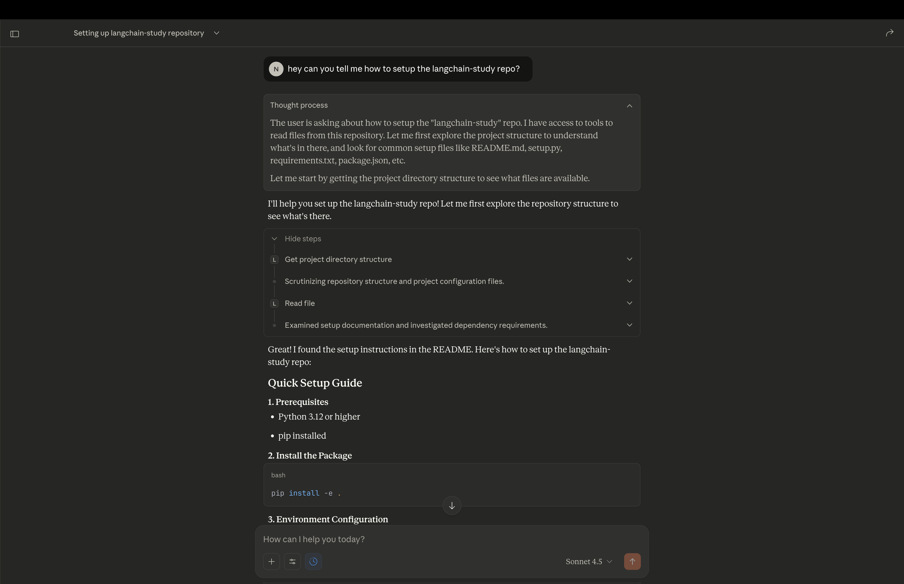
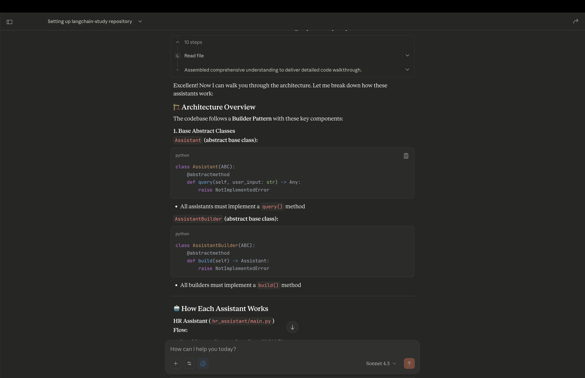
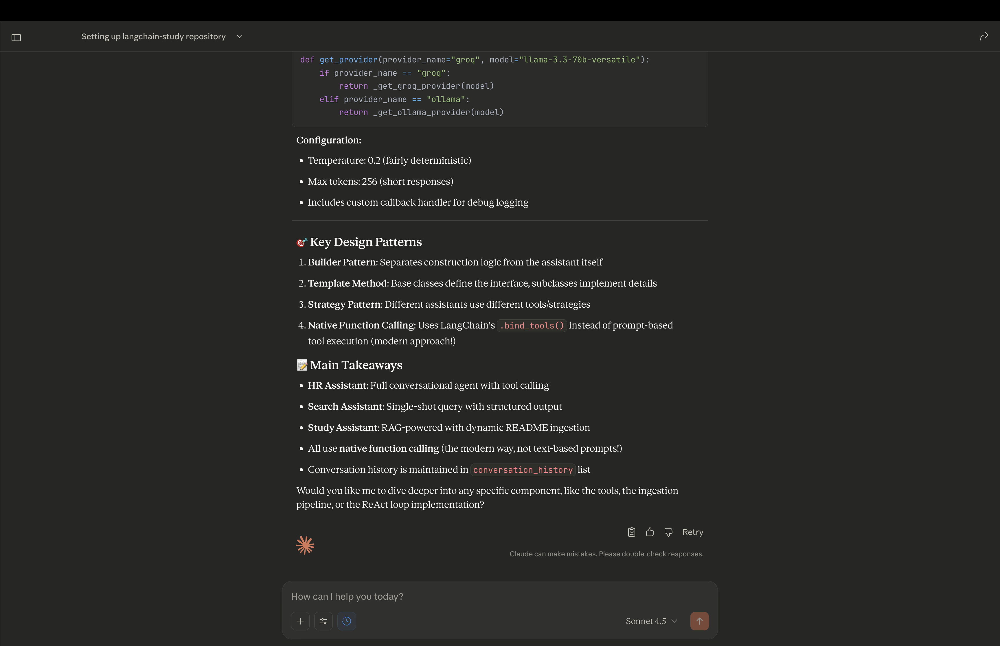

## How to navigate this repository using any LLM client (like Claude Desktop, Windsurf, etc.) <ins>which is MCP compliant

- The repo implements an MCP server which exposes the README as a resource and some tools for use by the LLM application.
- For `Claude Desktop` you can set the style to "Learning" mode/response style and get an enhanced experience!

### Set-up instructions for Claude Desktop

**<ins>These instructions are to be followed sequentially**

- Download [Claude Desktop](https://www.claude.com/download)
- Create a `claude_config.json` here:
```bash
touch ~/Library/Application\ Support/Claude/claude_desktop_config.json
```
- Activate your virtual environment:
```bash
conda activate <your_virtual_env>
```
- Install the project if you haven't done so:
```bash
cd /path/to/langchain-study/
pip install -e .
```
- Now find these paths by running the following bash commands (you need them for the config!):
```bash
which python

cd /path/to/langchain-study/
pwd

cd langchain-study/mcp/
pwd
```
- Great, now open the config using VSCode (or any text editor):
```bash
code ~/Library/Application\ Support/Claude/claude_desktop_config.json
```
- Copy/Paste this template and replace the paths here with the ones we discovered just now (in a previous step)!
  ```json
  {
    "mcpServers": {
      "langchain-study": {
        "command": "/opt/miniconda3/envs/nvidia-foundations/bin/python", 
        "args": [
          "/Users/nimo/Desktop/personal-dev/langchain-study/mcp/server.py"
        ],
        "env": {
          "REPO_ROOT": "/Users/nimo/Desktop/personal-dev/langchain-study"
        }
      }
    }
  }
  ```
  - The `"command"` key must be populated with the absolute path to the python executable for the virtual env that has the installed package.
    ```bash
    conda activate <your_virtual_env_name>
    which python
    ```
  - The `"args"` key must be populated with the absolute path to the `server.py` file on your local machine:
    ```bash
    cd langchain-study/mcp/
    pwd
    # append "/server.py" to the output of pwd
    ```
  - The `"REPO_ROOT"` key must be populated with the absolute path to the `langchain-study` repo on your local machine:
    ```bash
    cd /path/to/langchain-study/
    pwd
    ```
- That's it! If Claude Desktop is already open -> close it and restart it!
- Now you can directly ask questions about how to navigate this repository, see these examples:



